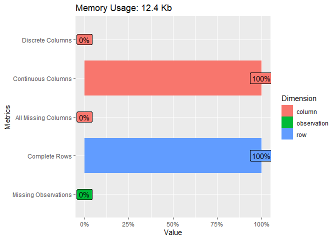
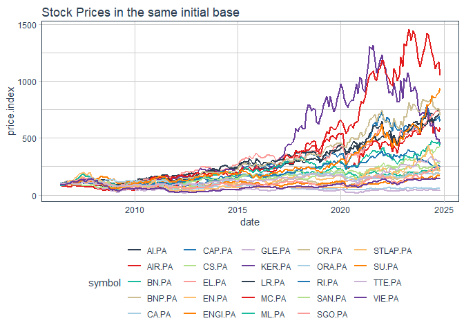
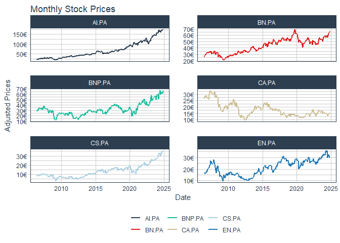
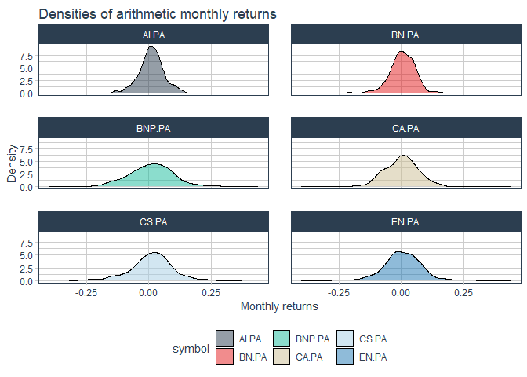
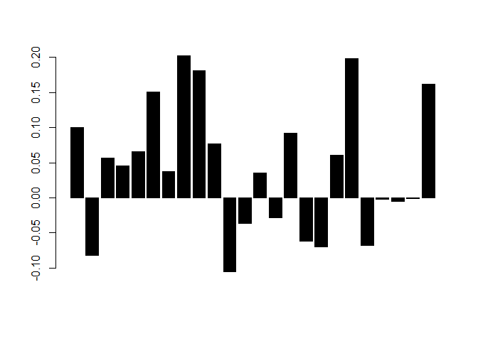
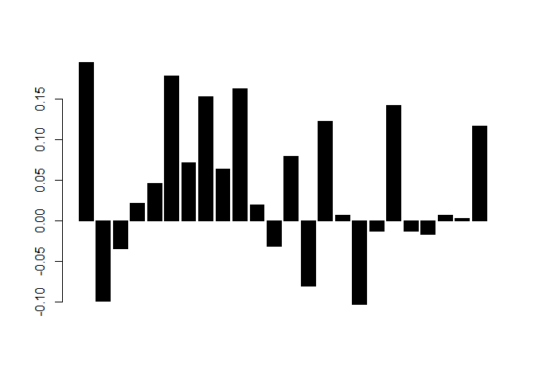
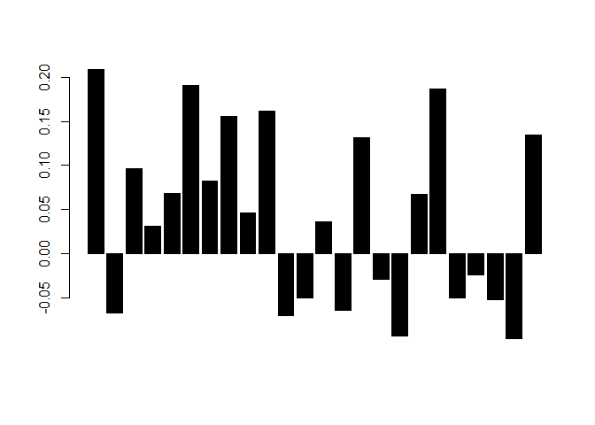

Workshop 1 - Equity portfolio choice, Global Minimum Variance portfolio
and factor models
================
Pierre Clauss
October 2024

*The following R Markdown document has to be read with my course notes
(in particular for the details of the analysis framework).*

*Not all the R codes are displayed but only some of them to help you to
succeed the workshop.*

## Foreword

To begin these workshops, I have to precise the 3 necessary steps for a
data science project:

1.  data: (i) importation, (ii) wrangling and (iii) visualisation (or
    named also *exploratory data analysis*)
2.  modelling
3.  results communication

To achieve these 3 steps, the universe of the package **tidyverse** is
essential for R nowadays.

``` r
library(tidyverse)
```

The first step on data seems often a thankless task but it takes time
(we can estimate it to more than 50% of a data science project) and it
is essential for the success of the project.

The second step is the most grateful for a data scientist. But it is
important to know that the first step and the second one are overlapped:
indeed, when I wrangle or I visualise my data, I often have an idea of
the models I will try.

Finally, the third step is often neglected to a simple ppt, word or tex
document. But it has to be more appreciated with the new tools and this
example of R Markdown document and github website is an attempt to show
you how to communicate better the results of a data science project.

## 1 Data

### 1.1 Importation

I import the data with the package **tidyquant**, which allows to import
financial data directly from Yahoo Finance.

``` r
library(tidyquant)
symbols <-
  c(
    "AI.PA",
    "CS.PA",
    "BNP.PA",
    "EN.PA",
    "CA.PA",
    "BN.PA",
    "ENGI.PA",
    "EL.PA",
    "LR.PA",
    "OR.PA",
    "MC.PA",
    "ML.PA",
    "RI.PA",
    "SGO.PA",
    "SAN.PA",
    "SU.PA",
    "GLE.PA",
    "STLAP.PA",
    "TTE.PA",
    "VIE.PA",
    "CAP.PA",
    "AIR.PA",
    "KER.PA",
    "ORA.PA"
  )

stock_prices <- symbols %>%
  tq_get(get  = "stock.prices",
         from = "2006-05-02",
         to   = "2024-10-31") %>%
  group_by(symbol)
```

The start date is 2nd May 2006.

### 1.2 Wrangling

The wrangling (*démêlage* in French) consists in the storage and the
transformation of the data. “Tidying and transforming are called
**wrangling**, because getting your data in a form that’s natural to
work with often feels like a fight” [R for Data
Science](https://r4ds.had.co.nz/introduction.html) (Grolemund G. and
Wickham H.).

I need for the workshop returns to construct portfolios on: so I
calculate monthly returns from daily stock prices and define the right
format to obtain a matrix of the returns by stock.

``` r
monthly_returns <- stock_prices %>%
  group_by(symbol) %>%
  tq_transmute(
    select     = adjusted,
    mutate_fun = periodReturn,
    period     = "monthly",
    type       = "arithmetic",
    col_rename = "monthly.returns"
  )

table_returns <- monthly_returns %>%
  pivot_wider(names_from = symbol, values_from = monthly.returns) %>%
  select(-"date") %>%
  na.omit()
```

Then, the wrangling is quite simple here: data are tidy - each column is
a variable (a stock) and each line is an observation (a month) - and
data have been transformed in financial returns, which are used to model
a portfolio.

As I said just before, data and modelling steps are effectively
overlapped. I can confirm this relation between the two steps with the
choice of monthly observations. Indeed, monthly returns are nearer to
gaussian data than weekly and daily data: they present less extreme
variations (see next section on data viz). As theoretical framework of
H. Markowitz behaves well with gaussian data, this choice is relevant.

To simplify our communication of results, I focus on the 6 first
variables.

``` r
(table_returns_first <- table_returns %>% select(1:6))
```

    ## # A tibble: 222 × 6
    ##       AI.PA   CS.PA   BNP.PA   EN.PA    CA.PA   BN.PA
    ##       <dbl>   <dbl>    <dbl>   <dbl>    <dbl>   <dbl>
    ##  1 -0.0345   0.0152  0.00185  0.0115  0.00524 -0.0301
    ##  2  0.0365  -0.0199  0.0671  -0.0519  0.0130   0.0552
    ##  3  0.0374   0.0385  0.0174  -0.0276  0.0648   0.0412
    ##  4  0.0424   0.0741  0.0892   0.0514 -0.0133   0.0377
    ##  5 -0.0231   0       0.0229   0.0263  0.0347   0.0307
    ##  6  0.0367   0.0345  0.0153   0.0830 -0.0419   0.0370
    ##  7  0.0246  -0.0333 -0.0557  -0.0186 -0.0111   0.0122
    ##  8  0.0527   0.0690  0.0160   0.0848 -0.0269  -0.0120
    ##  9 -0.00667  0.0323  0.0351   0.0662 -0.0379   0.0296
    ## 10 -0.0304   0      -0.0783   0.0164  0.142    0.0127
    ## # ℹ 212 more rows

We can see below, thanks to the package **DataExplorer**, a summary of
the tidy data observed for the first 6 variables.

``` r
library(DataExplorer)
plot_intro(table_returns_first)
```

<!-- -->

I can conclude that data are tidy without missing values.

### 1.3 Visualisation

Data viz has to be thought in relation with modelling. We have just seen
that the modelling framework needs gaussian data; it needs also not
perfectly correlated data. Then, I am interested by visualising the
distribution of the returns and the structure of the correlations
between them.

First of all, I can observe the evolutions of stock prices.

``` r
monthly_returns %>%
  mutate(price.index = 100 * cumprod(1 + monthly.returns)) %>%
  ggplot(aes(x = date, y = price.index, color = symbol)) +
  geom_line(size = 1) +
  labs(title = "Stock Prices in the same initial base") +
  theme_tq() +
  scale_color_tq()
```

<!-- -->

``` r
monthly_prices <- stock_prices %>%
  group_by(symbol) %>%
  tq_transmute(select = adjusted,
               mutate_fun = to.monthly,
               indexAt = "lastof")

monthly_prices %>%
  ungroup() %>%
  slice_head(n = nrow(table_returns) * 6) %>%
  ggplot(aes(x = date, y = adjusted, color = symbol)) +
  geom_line(size = 1) +
  labs(
    title = "Monthly Stock Prices",
    x = "Date",
    y = "Adjusted Prices",
    color = ""
  ) +
  facet_wrap( ~ symbol, ncol = 2, scales = "free_y") +
  scale_y_continuous(labels = scales::dollar_format(suffix = "€", prefix = "")) +
  theme_tq() +
  scale_color_tq()
```

<!-- -->

Some statistics to sum up the distribution are shown below: I can
observe symmetric data with a median and a mean which are quite equal.

``` r
summary(table_returns_first)
```

    ##      AI.PA              CS.PA              BNP.PA              EN.PA          
    ##  Min.   :-0.13454   Min.   :-0.39935   Min.   :-0.371703   Min.   :-0.246900  
    ##  1st Qu.:-0.01749   1st Qu.:-0.03401   1st Qu.:-0.051054   1st Qu.:-0.035574  
    ##  Median : 0.01178   Median : 0.01438   Median : 0.012538   Median : 0.005015  
    ##  Mean   : 0.01026   Mean   : 0.01120   Mean   : 0.008583   Mean   : 0.005243  
    ##  3rd Qu.: 0.03724   3rd Qu.: 0.05961   3rd Qu.: 0.067134   3rd Qu.: 0.051362  
    ##  Max.   : 0.13924   Max.   : 0.42841   Max.   : 0.439122   Max.   : 0.268997  
    ##      CA.PA                BN.PA          
    ##  Min.   :-0.2430708   Min.   :-0.207393  
    ##  1st Qu.:-0.0448148   1st Qu.:-0.024752  
    ##  Median : 0.0036579   Median : 0.005868  
    ##  Mean   :-0.0002636   Mean   : 0.005107  
    ##  3rd Qu.: 0.0431890   3rd Qu.: 0.038877  
    ##  Max.   : 0.1592891   Max.   : 0.152109

I can go deeper thanks to distribution graphics: the non-parametric
(kernel method) estimation of the distribution and QQ-plots.

``` r
monthly_returns %>%
  ungroup() %>%
  slice_head(n = nrow(table_returns) * 6) %>%
  ggplot(aes(x = monthly.returns, fill = symbol)) +
  geom_density(alpha = 0.5) +
  labs(title = "Densities of arithmetic monthly returns",
       x = "Monthly returns", y = "Density") +
  theme_tq() +
  scale_fill_tq() +
  facet_wrap(~ symbol, ncol = 2)
```

<!-- -->

``` r
monthly_returns %>%
  ungroup() %>%
  slice_head(n = nrow(table_returns) * 6) %>%
  ggplot(aes(sample = monthly.returns, fill = symbol)) +
  stat_qq() +
  stat_qq_line() +
  labs(title = "QQ-plots versus Normal distribution",
       x = "Normal returns", y = "Monthly returns") +
  theme_tq() +
  scale_fill_tq() +
  facet_wrap(~ symbol, ncol = 2)
```

<!-- -->

Finally, I can visualize the correlations between each of the 24 stock
returns. To obtain efficient diversification between assets, we need
correlations smaller than 1, which can be observed in the graph below.

``` r
library(corrplot)
corrplot(
  cor(table_returns),
  type = 'upper',
  tl.col = 'black',
  tl.cex = 0.1
)
```

<!-- -->

## 2 Modelling

Before all, I need to load the package **scales** to communicate with a
pretty way the results of our allocations.

``` r
library(scales)
```

### 2.1 Analysis framework

The analysis framework of our modelling is the Modern Portfolio Theory
initiated by H. Markowitz in the 1950s. An essential portfolio which is
agnostic on expected returns is the *Global Minimum Variance* (GMV)
portfolio for which the weights
 are
equal to :


with 
the covariance matrix between assets returns,

and  a vector of
 of length
, the number of assets
in the portfolio.

### 2.2 Estimation methodologies

I can propose 2 plug-in methodologies to estimate the GMV portfolio and
to achieve our objective:

1.  classical estimators without bias
2.  estimators constructed with a more robust method to decrease the
    noise of the data (factorial modelling)

Before modelling, I separate the initial sample between a learning
sample and a backtest sample to evaluate the performance of our
modelling. I choose December 2019 as a separation date to backtest the
strategy on the last 2 years of the sample.

``` r
end_date <- nrow(table_returns)
table_returns_learning <- table_returns %>% slice(1:164)
table_returns_backtest <- table_returns %>% slice(165:end_date)
```

There are 164 learning observations and 58 backtest observations. My
objective is to observe if the ex-ante (or anticipated) volatility
(equal to

for the GMV portfolio) is near to the ex-post (or realised) volatility
and if these volatilities are well minimised.

#### 2.2.1 Unbiased GMV portfolio

The GMV portfolio is only based on the covariance matrix estimation
.
This matrix estimator is inversed in the formula to determine the
weights of the portfolio. Then I can propose an unbiased estimator of
the inverse covariance matrix:

\left(r_t-\hat\mu\right)'")

with
,
 the number of
observations,  the
number of assets and
 the vector of
financial returns for the
 assets observed at time
.

Then, I can plug-in this estimate in the formula of the GMV portfolio to
obtain unbiased estimators of GMV weights.

``` r
n <- ncol(table_returns_learning)
T <- nrow(table_returns_learning)
e <- rep(1, n)
perio <- 12

Sigma <- cov(table_returns_learning) * (T - 1) / (T - n - 2) * perio
C <- t(e) %*% solve(Sigma) %*% e
sigmag <- sqrt(1 / C)
omega <- 1 / as.numeric(C) * solve(Sigma) %*% e
barplot(as.numeric(omega), col = 'black')
```

<!-- -->

The anticipated volatility of the portfolio constructed on the learning
sample is equal to 11.42%.

The realised volatility of the portfolio observed on the backtest sample
is equal to 14.06%.

**Code for the realised volatility (with Alt Gr 7 at the beginning and
at the end): r percent(sd(as.matrix(table_returns_backtest) %*% omega) *
sqrt(perio), accuracy = 0.01)**

I am going to improve these results thanks to a more robust statistical
approach.

#### 2.2.2 GMV portfolio with factorial modelling (1 factor)

I use Principal Component Analysis (PCA) to improve
.
Because of its high dimensionality, the inversion of the matrix could be
noisy. Then I reduce the dimensionality to one systematic factor (and 3
factors in the next section). This modelling is inspired by W. Sharpe
who was the first to propose a factor structure of the covariance matrix
with the *Single-Index Model* in 1963. To go further see pages 304-305
of the [chapter written by M. Brandt in 2010 in the Handbook of
Financial
Econometrics](https://www.sciencedirect.com/science/article/abs/pii/B9780444508973500080?via%3Dihub).

I can write the estimator (remind my course for the proof) with the
following formula:


with

the first eigenvalue of the unbiased estimator of the covariance matrix,
 the
first eigenvector and

the diagonal residual covariance matrix determined for each asset
 thanks to:

 = \text{Var}\left(r_i\right) - \phi_{1i}^2\lambda_1")

Then, I can plug-in this estimator of covariance matrix in the formula
of the GMV portfolio to obtain a more robust estimator of GMV weights.

``` r
valp <- eigen(Sigma)$values
vecp <- eigen(Sigma)$vectors
vp1 <- vecp[, 1]
lambda1 <- valp[1]
varepsilon1 <- diag(Sigma) - vp1 ^ 2 * lambda1
Sigma_epsilon1 <- diag(varepsilon1, n, n)
Sigma1 <- (lambda1 * vp1 %*% t(vp1) + Sigma_epsilon1)
C1 <- t(e) %*% solve(Sigma1) %*% e
sigmag1 <- sqrt(1 / C1)
omega1 <- 1 / as.numeric(C1) * solve(Sigma1) %*% e
barplot(as.numeric(omega1), col = 'black')
```

<!-- -->

The anticipated volatility of the portfolio constructed on the learning
sample is equal to 8.76%.

The realised volatility of the portfolio observed on the backtest sample
is equal to 12.46%.

#### 2.2.3 GMV portfolio with factorial modelling (3 factors)

I can write the estimator with the following formula:


with

the diagonal matrix of the three first eigenvalues of the unbiased
estimator of the covariance matrix,
 the
matrix with the first three eigenvectors and

the diagonal residual covariance matrix determined for each asset
 thanks to:

 = \text{Var}\left(r_i\right) - \phi_{1i}^2\lambda_1 - \phi_{2i}^2\lambda_2 - \phi_{3i}^2\lambda_3")

Then, I can plug-in this estimator of covariance matrix in the formula
of the GMV portfolio to obtain a more robust estimator of GMV weights.

<!-- -->

The anticipated volatility of the portfolio constructed on the learning
sample is equal to 9.72%.

The realised volatility of the portfolio observed on the backtest sample
is equal to 14.03%.

## To conclude the first workshop

This workshop is the first of my course on Asset Management dedicated to
equities and GMV portfolio. I present some improvements of the classical
plug-in estimator of the covariance matrix thanks to factorial
modelling.
