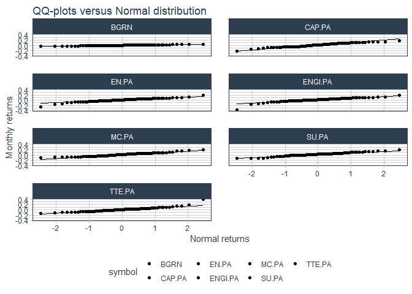
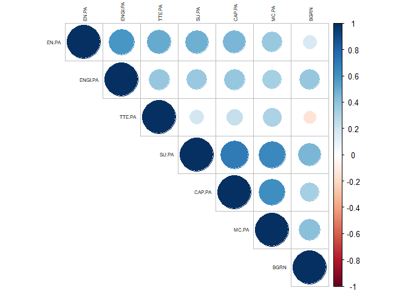
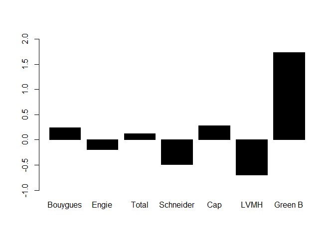

Workshop 2 - Multi-assets tactical allocation, Tangency Portfolio and
Black-Litterman approach with ESG views
================
Pierre Clauss
October 2024

*The following R Markdown document has to be read with my course notes
(in particular for the details of the analysis framework).*

*Not all the R codes are displayed but only some of them to help you to
succeed the workshop.*

## 1 Data

### 1.1 Importation

I import the data with the package **tidyquant**, which allows to import
financial data directly from Yahoo Finance. I import 6 equities from CAC
40 and with a good balance between green and brown peculiarities:
Bouygues, Engie, Schneider Electric, TotalEnergies, Capgemini and LVMH.
I import also a green bond ETF proposed by BlackRock.

``` r
library(tidyverse)
library(tidyquant)

symbols <-
  c("EN.PA",
    "ENGI.PA",
    "SU.PA",
    "TTE.PA",
    "CAP.PA",
    "MC.PA",
    "BGRN")

stock_prices <- symbols %>%
  tq_get(get  = "stock.prices",
         from = "2018-11-27",
         to   = "2024-10-31") %>%
  group_by(symbol)
```

The start date is November 2018.

### 1.2 Wrangling

I need for the workshop only returns to do calculation on: so I shrink
the data of workshop 2 to returns.

``` r
monthly_returns <- stock_prices %>%
  group_by(symbol) %>%
  tq_transmute(
    select     = adjusted,
    mutate_fun = periodReturn,
    period     = "monthly",
    type       = "arithmetic",
    col_rename = "monthly.returns"
  )

table_returns <- monthly_returns %>%
  pivot_wider(names_from = symbol, values_from = monthly.returns) %>%
  select(-"date") %>%
  na.omit()
```

Then, the wrangling is quite simple here: data are tidy - each column is
a variable (an equity) and each line is an observation (a month) - and
data have been transformed in financial returns, which are used to model
a portfolio. Returns are monthly returns because they are nearer to
gaussian data than weekly and daily data.

We can see below, thanks to the package **DataExplorer**, a summary of
the observed data.

``` r
library(DataExplorer)
plot_intro(table_returns)
```

<!-- -->

I can conclude that data are tidy without missing values.

### 1.3 Visualisation

Data viz has to be thought in relation with modelling. As for workshop
1, I am interested by visualising the distributions of the returns and
the structure of the correlations between them.

First of all, I can observe the evolutions of stock prices.

``` r
monthly_returns %>%
  mutate(price.index = 100 * cumprod(1 + monthly.returns)) %>%
  ggplot(aes(x = date, y = price.index, color = symbol)) +
  geom_line(size = 1) +
  labs(title = "Stock Prices in the same initial base") +
  theme_tq() +
  scale_color_tq()
```

<!-- -->

``` r
monthly_prices <- stock_prices %>%
  group_by(symbol) %>%
  tq_transmute(select = adjusted,
               mutate_fun = to.monthly,
               indexAt = "lastof")

monthly_prices %>%
  ggplot(aes(x = date, y = adjusted, color = symbol)) +
  geom_line(size = 1) +
  labs(
    title = "Monthly Stock Prices",
    x = "Date",
    y = "Adjusted Prices",
    color = ""
  ) +
  facet_wrap(~ symbol, ncol = 2, scales = "free_y") +
  scale_y_continuous(labels = scales::dollar_format(suffix = "€", prefix = "")) +
  theme_tq() +
  scale_color_tq()
```

<!-- -->

Some statistics to sum up the distribution are shown below: I cannot
observe for all returns symmetric data with a median and a mean which
could be quite equal.

``` r
summary(table_returns)
```

    ##      EN.PA              ENGI.PA             SU.PA              TTE.PA         
    ##  Min.   :-0.246900   Min.   :-0.37379   Min.   :-0.13394   Min.   :-0.130592  
    ##  1st Qu.:-0.027360   1st Qu.:-0.02511   1st Qu.:-0.01467   1st Qu.:-0.041797  
    ##  Median : 0.008089   Median : 0.01592   Median : 0.02562   Median : 0.003991  
    ##  Mean   : 0.005297   Mean   : 0.01094   Mean   : 0.02385   Mean   : 0.010811  
    ##  3rd Qu.: 0.046800   3rd Qu.: 0.05713   3rd Qu.: 0.06354   3rd Qu.: 0.050041  
    ##  Max.   : 0.185790   Max.   : 0.19114   Max.   : 0.19167   Max.   : 0.387490  
    ##      CAP.PA             MC.PA               BGRN          
    ##  Min.   :-0.22395   Min.   :-0.09325   Min.   :-0.040008  
    ##  1st Qu.:-0.04956   1st Qu.:-0.03553   1st Qu.:-0.007654  
    ##  Median : 0.01391   Median : 0.01680   Median : 0.002721  
    ##  Mean   : 0.01270   Mean   : 0.01562   Mean   : 0.001657  
    ##  3rd Qu.: 0.07458   3rd Qu.: 0.06135   3rd Qu.: 0.013709  
    ##  Max.   : 0.17309   Max.   : 0.20035   Max.   : 0.039630

I can go deeper thanks to distribution graphics: the non-parametric
(kernel method) estimation of the distribution and QQ-plots.

``` r
monthly_returns %>%
  ggplot(aes(x = monthly.returns, fill = symbol)) +
  geom_density(alpha = 0.5) +
  labs(title = "Densities of arithmetic monthly returns",
       x = "Daily returns", y = "Density") +
  theme_tq() +
  scale_fill_tq() +
  facet_wrap( ~ symbol, ncol = 2)
```

<!-- -->

``` r
monthly_returns %>%
  ggplot(aes(sample = monthly.returns, fill = symbol)) +
  stat_qq() +
  stat_qq_line() +
  labs(title = "QQ-plots versus Normal distribution",
       x = "Normal returns", y = "Monthly returns") +
  theme_tq() +
  scale_fill_tq() +
  facet_wrap( ~ symbol, ncol = 2)
```

<!-- -->

Finally, I can visualize the correlations between each of the equities
and bond returns. To obtain efficient diversification between assets, we
need correlations smaller than 1, which can be observed in the graph
below.

``` r
library(corrplot)
corrplot(
  cor(table_returns),
  type = 'upper',
  tl.col = 'black',
  tl.cex = 0.5
)
```

<!-- -->

## 2 Modelling

Before all, I need to load the package **scales** to communicate with a
pretty way the results of our allocations.

``` r
library(scales)
```

### 2.1 Analysis framework

The analysis framework of our modelling is the Modern Portfolio Theory
initiated by H. Markowitz in the 1950s. An essential portfolio, with the
*Global Minimum Variance* (GMV) portfolio studied in the workshop 1, is
the *Tangency Portfolio* (TP), also named *Maximum Sharpe ratio
portfolio*, for which the weights
 are
equal to :


with 
the covariance matrix between assets returns of length
, with
 the number of assets in
the portfolio,

the vector of the expected excess returns equal to

with  the
expected returns, 
the risk-free rate and 
a vector of  of length
 and finally
.

Contrary to GMV portfolio, we have to estimate also
 with
. Here,
I will present the estimation methodology proposed by F. Black and R.
Litterman (BL) in 1990 and 1992 to estimate
: see [the
following
paper](https://papers.ssrn.com/sol3/papers.cfm?abstract_id=334304) to
demystify this approach.

I then construct a multi-assets allocation with equity, bond and
monetary assets (null weight for this last asset in the TP).

### 2.2 Estimation methodology

Before modelling, I separate the initial sample between a learning
sample and a backtest sample to evaluate the performance of our
modelling. I choose May 2023 as a separation date to backtest the
strategy on the last 2 years of the sample.

``` r
end_date <- nrow(table_returns)
table_returns_learning <- table_returns %>% slice(1:55)
table_returns_backtest <- table_returns %>% slice(56:end_date)
```

There are 55 learning observations and 16 backtest observations. My
objective is to observe if I can obtain better performance with a
tactical allocation on the backtest sample. Before all, I present the
construction of the strategic allocation.

#### 2.2.1 Strategic allocation for the Tangency Portfolio

I begin with classical unbiased estimators for
 and
:


\left(r_t-\hat\mu\right)'")

Then, I can plug-in these estimates on the formula of the TP to obtain
unbiased estimators of its weights. I assume that
.

<!-- -->

The realised return observed on the backtest sample of the portfolio
constructed on the learning sample is equal to 11.65%.

I am going to improve this result thanks to a more robust statistical
approach integrating economic predictions in the allocation.

#### 2.2.2 Tactical allocation for the Tangency Portfolio with Black-Litterman approach

Tactical allocation is a process that deviates the strategic allocation
thanks to new information: for instance, if I think that one index will
perform better in the near future, then I will increase its weight
relative to the others.

Black-Litterman approach is one of a quantitative methodology to
integrate these predictions/views in a relevant way. This approach adds
to economic predictions statistical uncertainty: the econometric
approach is no more a plug-in approach but a decision-bayesian approach.

The Black-Litterman returns are the following mixed estimates:

![\hat\mu\_\text{mixed} = \left\[\left(\tau\hat\Sigma\right)^{-1} + \Omega^{-1}\right\]^{-1} \left\[\left(\tau\hat\Sigma\right)^{-1}\hat\mu + \Omega^{-1}Q\right\]](https://latex.codecogs.com/png.latex?%5Chat%5Cmu_%5Ctext%7Bmixed%7D%20%3D%20%5Cleft%5B%5Cleft%28%5Ctau%5Chat%5CSigma%5Cright%29%5E%7B-1%7D%20%2B%20%5COmega%5E%7B-1%7D%5Cright%5D%5E%7B-1%7D%20%5Cleft%5B%5Cleft%28%5Ctau%5Chat%5CSigma%5Cright%29%5E%7B-1%7D%5Chat%5Cmu%20%2B%20%5COmega%5E%7B-1%7DQ%5Cright%5D "\hat\mu_\text{mixed} = \left[\left(\tau\hat\Sigma\right)^{-1} + \Omega^{-1}\right]^{-1} \left[\left(\tau\hat\Sigma\right)^{-1}\hat\mu + \Omega^{-1}Q\right]")

with  the economic views
quantified by average returns,
 the
confidence parameter in the views and
 the
matrix of uncertainty associated to the economic views; we assume that
 is a
diagonal matrix with diagonal elements equal to variances of assets
returns.

I use [Sustainalytics’ ESG risk
assessment](https://www.sustainalytics.com/esg-data) which measures the
risk faced by a company’s value due to environmental, social, and
governance issues. The ESG rating measures risk on an absolute scale
from 0 to 100. The lowest rating indicates that ESG risk is best
managed. It is available since 2014 and published on Yahoo Finance since
2018.

And, I transform the ratings in returns to obtain
.

``` r
# Example of parameters for BL approach
note <- numeric(n)
note[1] <- -2 # Bouygues negative rating 35
note[2] <- -1 # Engie negative rating 30
note[3] <- 1 # Schneider positive rating 11
note[4] <- -1 # TotalEnergies negative rating 28
note[5] <- 1 # Capgemini positive rating 11
note[6] <- 1 # LVMH positive rating 12
note[7] <- 1 # Green Bond positive rating
vol <- sqrt(diag(Sigma))
theta <- 0.2
Q <- mu + vol * note * theta
tau <- 0.5
```

<!-- -->

The realised return observed on the backtest sample of the BL portfolio
constructed on the learning sample is equal to 12.36%.

I can compare it to the portfolio constructed directly with views and
without uncertainty on the predictions. The realised return observed on
the backtest sample of this portfolio constructed on the learning sample
is equal to 11.13%. BL approach mitigates the return of this portfolio
by integrating uncertainty and then less confidence in the views.

## To conclude the second workshop

This workshop is the second of my course on Asset Management dedicated
to multi-assets allocation and Tangency Portfolio. I present some
improvements of the classical plug-in estimators thanks to the
Black-Litterman approach and an integration of ESG views.

To go beyond, I advise to read the academic paper of Pastor, Stambaugh
and Taylor [“Dissecting green
returns”](https://www.nber.org/system/files/working_papers/w28940/w28940.pdf)
where they show that green stocks do not insure outperformance relative
to brown ones.
